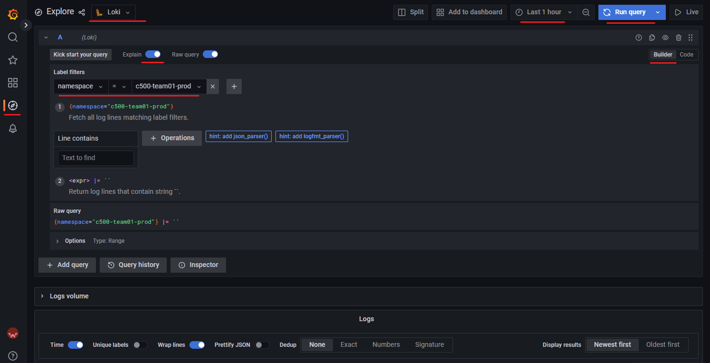
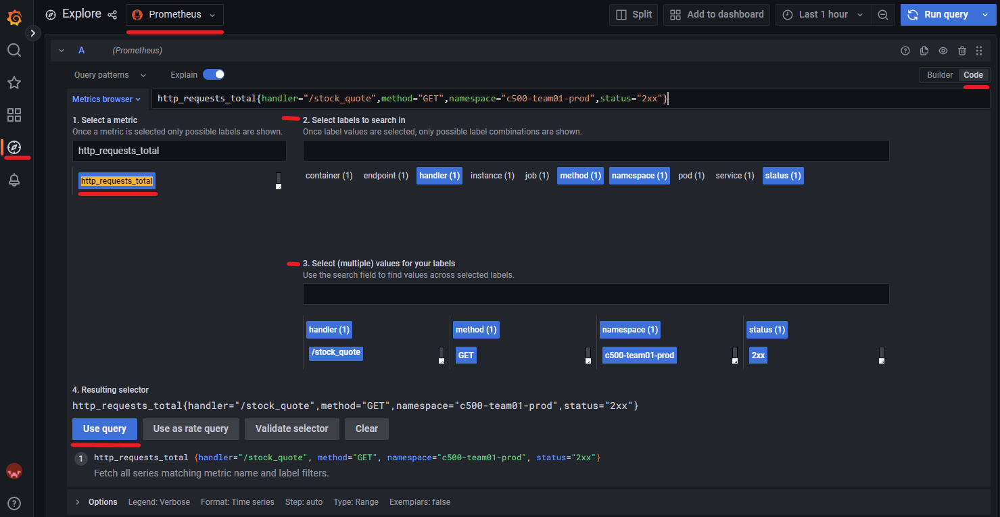

# Distributed Monitoring Systems
Monitoring applications increases site reliability by finding issues or recognizing patterns faster. This activity will introduce you to the in-place monitoring systems that are running in our Kubernetes environment. You will learn to use `Grafana` and the basics of `PromQL` and `LogQL`. 

Application monitoring results in decreased MTTD (Mean time-to Detect) and MTTR (Mean time-to Resolve) of issues. Additionally, monitoring dev environments and recognizing patterns should result in fewer bugs being released to production. 

## Loki 
A distributed log database capable of complex aggregations on log files. It is a `push` monitoring system, meaning that log files are pushed to the Loki service. Our environment is configured to push the Standard Output and Standard Error from any application to Loki.

Loki answers questions similar to "What percentage of logs were warnings in the past 24 hours?". A query language named `LogQL` is used to select and aggregate log files.

## Prometheus
A time series distributed database for application metrics. Prometheus is a `pull` database that sends requests to applications endpoints and pulls metrics into its database as time series data.

Prometheus answers questions like "What percentage of HTTP requests were successful?". 

## Grafana
A tool for making interactive dashboards based on data from data sources, such as Prometheus and Loki. Grafana also supports creating alerts. In this activity, Grafana is only used to execute queries, that later you will use to build dashboards and alerts.

# Instructions
Every part of our environment runs in a namespace in our Kubernetes cluster. This includes Jenkins, K8sdashboard, Grafana, Loki, Prometheus, and the app we deployed.

This activity will walk you through how our application is connected to our monitoring tools, and how to write queries on the data.

1. Within our K8s dashboard, we can see that Prometheus is a namespace in our cluster. [Click here](https://k8sdashboard.computerlab.online/#/workloads?namespace=prometheus) to briefly inspect the workload details of the Prometheus namespace.
2. Do the same for the Loki namespace by searching `loki` in the top search bar. Try to identify the images being used for the deployments.

> Loki, Prometheus and Grafana was setup by our devops team using [Helm](https://helm.sh/), a package manager for K8s. You can view the files in our [repo](https://github.com/The-Software-Guild/sre-course-infra/tree/main/flux/infrastructure/apps/base)


## Loki Introduction
The K8s cluster has been configured to send any standard output and standard error to Loki. 
1. visit https://grafana.computerlab.online/
2. click on Explore (the compass icon on the left)
3. Change the data source at the top of the page to `Loki`.
4. Make sure to turn the `Explain` toggle on for every query.
5. Make sure the `builder` is selected on the top right. If you ever need to paste source code, just toggle this to `code`.
6. Under Label Filter select `namespace`. On the other side of the equal sign, enter your namespace. 
7. Make sure the time frame (top right) is set to 1 hour to reduce query time. You can adjust this value, but longer time frames will take longer to execute and may time out.
8. Press `Run Query`. You should see all of the logs from any service running in your namespace.

If you had any trouble with the steps, refer to the image below.



Application logs may provide very detailed information about errors or warnings, such as an exception and line number. Try using the code builder to build more advanced queries before moving on.

One of the most important logs you will need to use in this environment is the `flux kustomize controller`. This is our GitOPS tool, **YAML Errors will show up in this log stream!**
  ```
  {job="flux-system/kustomize-controller"} |= `<COHORT>-<TEAM>-<ENV>` 
  ```

## LogQL

Now that we have interacted with our monitoring systems and executed a query, let's dive deeper into `LogQL`. LogQL is not indentation sensitive. Place code on multiple lines or one line. The `#` may be used for comments.

1. Go to the explore page in Grafana and make sure the data source is Loki. You can use the `code` or `build` query option. 
2. Start with this query `{namespace="<COHORT>-<TEAM>-<ENV>"}`. Just like before, it will pull all logs for services running in your namespace. In the code above, `namespace` is a label filter, allowing you to select which logs you want to view.
3. Add the `app="orderbookapi"` label filter to only show logs for that application. The resulting code:
    ```
    {
      namespace="<COHORT>-<TEAM>-<ENV>", 
      app="orderbookapi"
    }
    ```
    Try using other label filters and values to see what logs you can produce.
  4. If using the code builder, select "Line contains case insensitive". Otherwise, append this code 
      ``` 
      |~ `(?i)heartbeat`
      ```
      to the query resulting in
      ```
      {
        namespace="<COHORT>-<TEAM>-<ENV>", 
        app="orderbookapi"
      } |~ `(?i)heartbeat`
      ```
      and run the query. Notice that only log entries containing the word 'heartbeat' are returned. Let's decompose the new code.
      
      **Line Filters** - A line filter allows you to select log lines that match a condition. These are the different line filters. Modify the query above to use each of the line filters below.
      ```
        |= `heartbeat` # (line contains)  
        != `Heartbeat` # (line does not contain) 
        !~ `(?i)heartbeat` # (line does not contains pattern)
        |~ `(?i)heartbeat` # (line does contain pattern)
      ```
      LogQL uses Golang regex for pattern matching. Use a tool, such as [regex101](https://regex101.com/), to **practice and explain regular expressions**. The `(?i)` means case insensitive match for the remaining pattern, which is 'heartbeat' 

  5. Use the code builder to add a rate operation named `count_over_time`, or modify the code as shown below:
      ```
      count_over_time(
        {
          namespace="<COHORT>-<TEAM>-<ENV>",
          app="orderbookapi"
        } |~ `(?i)heartbeat` [1m]
      )
      ```
      Notice there are two things new, the `count_over_time` function and the `[1m]`. The `count_over_time` function returns the number of log lines per time range (`[1m]` in this case). Run this query and it will plot the number of heartbeat messages per minute. 
      
  6. Replace the `count_over_time` with `rate` to show the number of log entries per second per minute. Replace `1m` with `$__interval` to use a dynamic time range optimized for fitting the graph.
      ```
      rate(
        {
          namespace="<COHORT>-<TEAM>-<ENV>" 
          app="orderbookapi"
        } |~ `(?i)heartbeat`[$__interval]
      )
      ```

  7. What percentage of logs per minute are heartbeat logs? You can use the `count_over_time` or `rate` function with some simple math to answer this question.
      ```
      (
        count_over_time( # heartbeats
        {
          namespace="<COHORT>-<TEAM>-<ENV>", app="orderbookapi"
          } |~ `(?i)heartbeat` [1m]
        )
        / # divided by
        count_over_time( # all logs
          {
            namespace="<COHORT>-<TEAM>-<ENV>", app="orderbookapi"
            }  [1m]
        )
      ) * 100 # make it a percentage
      ```

Experiment with different aggregation functions and patterns in the log files. Explore the features of Grafana, such as query history.

## Parsing Logs
When using line filters, you are searching if a pattern is in a log. How would you select logs with a price greater than 100? That may prove challenging unless you parse the log into key-value pairs and use the `>` operator. Line filters will perform faster than parsing so try to use line filters when possible.

There is more than one way to parse log entries. You can pipe to the command `pattern` and create your key-value pairs based on patterns. More appropriate, if your logs are in JSON, you can pipe to the `json` command and use the key-value pairs in the logs.

1. These are the logs that contain "side": "buy"
    ```
    {namespace="<COHORT>-<TEAM>-<ENV>"} |= `"side": "buy"` 
    ```
2. Below is a sample of one. Notice that the json key "Price" has a value of "129.89". 
    ```
    {"fix-version": "FIX4.4", "MsgType": "Execution Report", ..., "OrdStatus": "Partially filled", "side": "buy", "Price": "129.89", "LastQty": "913", "ExecID": "exec2023-04-1219:25:57.925329", "OrderQty": "1000", "TransactTime": "2023-04-1219:25:57.925334", "AvgPx": "129.89", "CumQty": "187"}

    ```

  3. Parse the log entry by piping to `json`, then pipe it to the key Price and only return logs where the price is greater than 100 and the order quantity greater than 10. Examine the logs, try different conditions and aggregations. You can also use the keywords `and/or` instead of piping to the next key. 

      ```
      {namespace="<COHORT>-<TEAM>-<ENV>"} |= `"side": "buy"` | json | Price > 100 | OrderQty > 10
      ``` 
 
## Latency Example
Our K8s cluster is configured to log every web request to an app named ingress-nginx. Use the query below to view those logs. 

```
{app="ingress-nginx"} # all web request logs
```
Notice that all logs are `json`. Look at the logs, how can you search for your application logs? Hopefully, you noticed the `host` key. Use `json` to select the logs for your api.

```
{app="ingress-nginx"} | json | host =`<COHORT><TEAM><ENV>-api.computerlab.online`
```

You may receive parsing errors from improperly formatted json logs. Use the key `__error__` to remove those logs. Lets also remove any request for our metrics, and only retain successful (2xx) requests.

```
 {app="ingress-nginx"} 
  !="/metric" # remove logs with /metric
  | json  # parse with json
    |  __error__!=`JSONParserErr` # remove parsing erros 
    | host =`<COHORT><TEAM><ENV>-api.computerlab.online` # this host only
    | upstream_status=~"2[0-9]{2}"  # 2xx request
```

Did you notice the `upstream_response_time` key in the logs? Let's filter for requests that are faster than 0.1 seconds.

```
 {app="ingress-nginx"} 
  !="/metric" 
  | json  
    |  __error__!=`JSONParserErr` 
    | host =`<COHORT><TEAM><ENV>-api.computerlab.online` 
    | upstream_status=~"2[0-9]{2}"  
    | upstream_response_time < 0.1 
```

If we use `count_over_time` we will have a count for multiple log streams plotted. We can aggregate those log streams with `sum`. The code below plots the number of API requests faster than 0.1 seconds per minute. 

```
 sum(
  count_over_time({app="ingress-nginx"} 
    !="/metric" 
    | json  
      |  __error__!=`JSONParserErr` 
      | host =`<COHORT><TEAM><ENV>-api.computerlab.online` 
      | upstream_status=~"2[0-9]{2}"  
      | upstream_response_time < 0.1
  [1m])
 ) 
```

Let's make this more useful by making it a percentage of our total number of requests. This will tell us what percentage of API requests are responded to faster than 0.1 seconds.

```
 sum( # request faster than 0.1 seconds
  count_over_time({app="ingress-nginx"} 
    !="/metric" 
    | json  
      |  __error__!=`JSONParserErr` 
      | host =`<COHORT><TEAM><ENV>-api.computerlab.online` 
      | upstream_status=~"2[0-9]{2}"  
      | upstream_response_time < 0.1
  [1m])
 ) 

 / # divided by

  sum( # all request
  count_over_time({app="ingress-nginx"} 
    !="/metric" 
    | json  
      |  __error__!=`JSONParserErr` 
      | host =`<COHORT><TEAM><ENV>-api.computerlab.online` 
      | upstream_status=~"2[0-9]{2}"  
  [1m])
 ) * 100 # make into percentage
```


## Prometheus
Prometheus is configured to scrape data from any service running in our cluster that has an endpoint for `/metrics` over http and a Service Monitor. Our `api-ServiceMonitor.yaml` file creates a Service Monitor K8s resource in our namespace, which will monitor our OrderbookAPI deployment.

1. Examine the `/metrics` endpoint for the API service. `https://<COHORT><TEAM><ENV>-api.computerlab.online/metrics`. 

2. Examine the `api-ServiceMonitor.yaml` file in your namespace. This file tells our cluster to monitor the OrderbookAPI service. All Service Monitors in our K8s cluster are configured to scrape from /metrics.

3. Within the explore page of Grafana, change the data source from Loki to Prometheus (or Grafana Agent). Use the `code` query and `Metrics Browser` to explore available metrics.

4. From the list of metrics at `/metrics`, you will see one named `http_requests_total`. It counts how many requests have been sent. Find it in your ``Metrics Browser`` and build the query below. Refer to the image under the code.
    ```promql
    http_requests_total{
      handler="/stock_quote",
      method="GET",status="2xx" ,
      namespace="<COHORT>-<TEAM>-<ENV>"
    }
    ``` 
  
  
  - The metric `http_requests_total` has multiple label filters applied to select metrics for a specific 2xx GET request to '/stock_quote'. *Run the PromQL query, but be sure to update the namespace!*
5. Use the `/metrics` endpoint and `metric browser in Grafana` to build some different PromQL Queries. below is an example of one.

      Requests with status codes of 4xx are client errors (eg. 404 is file not found). Below is the percentage of client errors from all our requests since the launch of our app.
      ```
      sum(http_requests_total{ # number of 4xx request
        namespace="<COHORT>-<TEAM>-<ENV>", 
        status="4xx"
      }) 
      /  # divide by
      sum(http_requests_total{ # total number of request
        namespace="<COHORT>-<TEAM>-<ENV>"
      }) * 100 
      ```

6. The query above looks complete, however, `http_requests_total` is a `counter` type. Counter types always go up, so the equation above tells how many 4xx since the app has been launched. It is more useful to know how many requests per minute (or any time range) were 4xx. To achieve this, simply use `rate` or `count_over_time`. 
```
sum(rate(http_requests_total{ # number of 4xx request
  namespace="<COHORT>-<TEAM>-<ENV>", 
   handler!~"(metrics|docs)", # exclude these endpoints
  status="4xx"
}[1m])) 
/  # divide by
sum(rate(http_requests_total{ # total number of request
  namespace="<COHORT>-<TEAM>-<ENV>",
   handler!~"(metrics|docs)" # exclude these endpoints
}[1m])) * 100
```


The capability of reading real-time metrics from applications is fundamental to reliability. Metrics allow us to easily monitor latency, peak usage, percentage of failed requests, availability of replicas, the health of services, memory usage, CPU and more. 

## More PromQL
Prometheus is also obtaining metrics from the Kubernetes cluster, such as statistics on your container's memory.

```
rate(
  container_memory_working_set_bytes # metric
  {
    namespace="<COHORT>-<TEAM>-<ENV>",
    container="orderbookapi"
  }[1m]
)
```
Or your containers CPU usage
```
rate(
  container_cpu_usage_seconds_total # metric
  {
    namespace="<COHORT>-<TEAM>-<ENV>",
    container="orderbookapi"
  }[1m]
)
```
The code below displays the number of replicas for the database deployment.
```
kube_deployment_status_replicas_available{
  namespace="<COHORT>-<TEAM>-<ENV>", 
  deployment="orderbookdb"
}
```

This code below returns a 1 if the database is up. This is a great metric to set an alert on. There are more mysql metrics available and they are imported into Prometheus through the `deployment-mysqld-exporter.yaml
` deployment and the  `mysqld-exporter-podMonitor.yaml` pod monitor (similar to service monitor). These files are in your deployments directory! 
```
mysql_up{namespace="<COHORT>-<TEAM>-<ENV>"}
```

## Aggregations
Grouping and aggregation are useful because they allow us to use a single graph instead of multiple graphs to display the same query for different labels.

The latency example earlier uses the ingress-nginx logs to calculate the percentage of all requests faster than a threshold. What if we wanted that for every endpoint, would we have to make one for each endpoint?

We can achieve this using the `sum by`, which is similar to a SQL Group By and Sum. Consider the code below. It is the rate of request with latency less than or equal to (le) 0.5 seconds. 

```
rate(
    http_request_duration_seconds_bucket{
      handler!~"(none|/metrics)",
      le="0.5",
      namespace="<COHORT>-<TEAM>-<ENV>"
    }[1m])
```

The query above returns multiple series. We can not do math unless we use `sum` to combine the multiple series into one. Now we can divide it against itself.  
```
sum # Number of all request faster than 0.5 seconds
  (rate(
    http_request_duration_seconds_bucket{
      handler!~"(none|/metrics)",
      le="0.5",
      namespace="<COHORT>-<TEAM>-<ENV>"
    }[1m])
  ) 
  / # divide by
sum # all request
  (rate(
    http_request_duration_seconds_bucket{
      handler!~"(none|/metrics)",
      le="+Inf",# infinity, or all request
      namespace="<COHORT>-<TEAM>-<ENV>"
    } [1m])
  )
```
Now we can use `sum by` to group the data that we want to sum together. The code below will group all series with the same handler and sum those. For example, all series with the handler "stock_quote" will be separated from the handler "Trade". Now you can view and toggle the latency for all endpoints in one graph.

```
sum by (handler) 
  (rate(
    http_request_duration_seconds_bucket{
      handler!~"(none|/metrics)",
      le="0.5",
      namespace="<COHORT>-<TEAM>-<ENV>"
    }[$__rate_interval])
  ) 
  / 
sum by (handler) 
  (rate(
    http_request_duration_seconds_bucket{
      handler!~"(none|/metrics)",
      le="+Inf",
      namespace="<COHORT>-<TEAM>-<ENV>"
      }[$__rate_interval])
  )
```

Below is a LogQL example of an aggregation. It uses our namespace logs and only retains values with a matching pattern for the path. It then uses JSON so that we can use the label "path" in our aggregation. This will count the number of requests for each path (endpoint). If you are not sure about what values to sum by, simply examine the raw logs and look at what labels are detected.

```
sum(
  count_over_time(
    {namespace="<COHORT>-<TEAM>-<ENV>"} 
      |~ `"path": "/(trade|holdings|all_orders|stock_quote|stocklist).*"` 
      | json [$__interval] )) 
by (path)
```

Our Nginx logs may be a better source for volume than our API. However, there is no path field, and the request_uri field may differ for requests to the same endpoint. To use these logs, the code below uses a pattern extraction regex to create a field named path that we can sum by. Then, it matches the string "request_uri" and extracts the following matching characters until there is no match into a new field named path.

```
sum (count_over_time(
  {app="ingress-nginx"} |= `<COHORT><TEAM><ENV>` != `grafana` 
    | regexp `request_uri["\s:]+(?P<path>[\/]+[a-z_]+).*` [1m] ))
by (path)
```

## Conclusion
Monitoring our application provides insight into how reliable the customer experience is when engaging with our sites. This lesson described how the different monitoring components are integrated into the apps we deploy. Then we learned how to use the monitoring systems to query, and help us write queries. 

